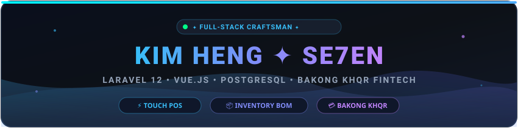

<div align="center">

  <!-- Self-Hosted Vector Header Banner (100% Reliable & Fast) -->
  <a href="https://github.com/SE7EN-01">
    
  </a>

  <!-- Animated Typing Banner -->
  <a href="https://git.io/typing-svg">
    
  </a>

  <br/>

  <p align="center">
    <samp>
      ⚡ <b>"Code is like humor. When you have to explain it, it's bad."</b> — Cory House ⚡
      <br/>
      📍 <b>Phnom Penh, Cambodia 🇰🇭</b> &nbsp;•&nbsp; 🎓 <b>RPITSB Graduate</b> &nbsp;•&nbsp; 💼 <b>Available for High-Impact Projects</b>
    </samp>
  </p>

  <!-- Live Profile Counter & Status Badges -->
  <p align="center">
    
    
    
  </p>

  <!-- Social & Direct Contact Channels -->
  <p align="center">
    <a href="https://t.me/Kim_Heng01" target="_blank">
      
    </a>
    <a href="https://web.facebook.com/kimheng.seng.902819/" target="_blank">
      
    </a>
    <a href="https://www.youtube.com/@SE7EN168-VC" target="_blank">
      
    </a>
    <a href="mailto:kimheng0361@gmail.com">
      
    </a>
    <a href="https://github.com/SE7EN-01?tab=followers">
      
    </a>
  </p>

</div>

---

### 📌 Quick Navigation
[👨‍💻 About Me](#-about-me) • [🏆 Profile Summary](#-github-profile-summary) • [🛠️ Skills & Tech Stack](#-arsenal--tech-stack) • [🚀 Featured Projects](#-featured-projects-showcase) • [📐 Architecture & Standards](#-engineering-philosophy--architecture) • [📊 Analytics & Metrics](#-github-analytics--metrics) • [🎧 Coding Zone](#-the-coding-zone--setup) • [📫 Connect](#-lets-collaborate--connect)

---

### 👨‍💻 About Me

> 🚀 **Full-Stack Web Craftsman & System Builder** based in **Phnom Penh, Cambodia 🇰🇭**  
> *Academic background from RPITSB (Regional Polytechnic Institute Techo Sen Battambang)*

```json
{
  "name": "Kim Heng",
  "alias": "SE7EN",
  "role": "Full-Stack Web Craftsman & System Builder",
  "location": "Phnom Penh, Cambodia 🇰🇭",
  "education": "Regional Polytechnic Institute Techo Sen Battambang (RPITSB)",
  "primary_stack": ["PHP 8.4", "Laravel 12.x", "Vue.js", "Alpine.js", "PostgreSQL"],
  "core_domains": ["Touch POS Register", "Recipe Inventory BOM Engine", "Bakong KHQR (NBC)"],
  "motto": "Atomic consistency & clean design"
}
```

- 🚀 **Specialty:** Modern Point of Sale (POS) Systems, Automated Recipe Bill of Materials (BOM) Deductions, and Cambodia's National Bakong KHQR Payment Rails.
- 💡 **Engineering Philosophy:** Clean Architecture, zero financial errors via ACID atomic transactions, and self-documenting code.
- 🌱 **Continuous Growth:** Exploring high-concurrency event-driven systems, micro-services, and Redis caching layers.

---

### 🏆 GitHub Profile Summary

<div align="center">
  
</div>

---

### 🛠️ Arsenal & Tech Stack

<div align="center">
  <!-- Interactive Skill Icons Grid -->
  <a href="https://skillicons.dev">
    
  </a>
</div>

<br/>

| Category | Technologies & Tools | Key Competencies |
| :--- | :--- | :--- |
| **Backend Engineering** | `PHP 8.4`, `Laravel 11/12`, `Python`, `C++`, `C#` | RESTful API design, Service-Repository Pattern, Middleware, Eloquent Relationships, Authentication (Sanctum/Breeze) |
| **Frontend & UI/UX** | `JavaScript (ES6+)`, `TypeScript`, `Vue.js 3`, `Alpine.js`, `Tailwind CSS 3.4`, `Bootstrap 5`, `HTML5/CSS3`, `Blade` | Reactive interfaces, Touch-optimized UI, State Management, Custom Tailwind themes, Smooth CSS transitions |
| **Databases & Storage** | `PostgreSQL 16`, `MySQL 8`, `SQLite`, `Redis` | Schema design, Indexing & query optimization, ACID Atomic transactions, Foreign key cascades, Database migrations & seeders |
| **Fintech & Integrations** | `Bakong Dynamic KHQR (NBC API)`, `Payment Gateways`, `Webhooks` | Real-time QR generation (USD & KHR), Webhook signature verification, Instant payment reconciliations |
| **Testing & Quality** | `Pest PHP`, `PHPUnit`, `PSR-12 Standards`, `TDD` | Comprehensive Feature & Unit testing, Test-Driven Development, Mocking external APIs |
| **DevOps & Tooling** | `Git`, `GitHub Actions`, `Vite`, `Composer`, `NPM`, `Docker`, `Postman`, `TablePlus`, `VS Code` | Version control workflows, CI/CD pipeline automation, API testing, Dependency management |

---

### 🚀 Featured Projects Showcase

<table>
  <tr>
    <td width="50%">
      <h3 align="center">☕ Bong Heng Cafe POS & Inventory System</h3>
      <p align="center">
        
        
        
        
      </p>
      <p>An enterprise-grade, touch-optimized Cafe Point of Sale and intelligent inventory ecosystem.</p>
      <ul>
        <li><b>Touchscreen Cashier Register (<code>/pos</code>):</b> Real-time ordering, fast category switches, drink customizer (Sugar %, Ice level, Extra espresso shots).</li>
        <li><b>Visual Floor Plan (<code>/admin/tables</code>):</b> Dynamic visual table map tracking Dine-in, Takeaway, Occupied & Reserved tables.</li>
        <li><b>Smart Recipe BOM Engine:</b> Automatically deduces exact raw ingredients (coffee beans in grams, milk in ml, syrup in pumps) on checkout using atomic DB transactions.</li>
        <li><b>Integrated KHQR:</b> Instant QR generation on customer receipt screen for fast digital cashierless checkout.</li>
        <li><b>70+ Automated Pest Tests:</b> Complete test coverage ensuring total financial accuracy.</li>
      </ul>
      <p align="center">
        <a href="https://github.com/SE7EN-01/CafePos_PHP_Final"><b>View Source Code ➔</b></a>
      </p>
    </td>
    <td width="50%">
      <h3 align="center">💳 Bakong KHQR Transaction Engine</h3>
      <p align="center">
        
        
        
      </p>
      <p>High-reliability payment processing module connecting Cambodian web applications directly to the National Bank of Cambodia (NBC) Bakong payment rails.</p>
      <ul>
        <li><b>Dynamic KHQR Generation:</b> Instant generation of EMVCo-compliant QR codes in both KHR and USD currencies with custom transaction IDs.</li>
        <li><b>Secure Webhook Receiver:</b> Handles background asynchronous callbacks from banking APIs with HMAC signature validation.</li>
        <li><b>Auto-Reconciliation:</b> Eliminates manual cashier confirmation by polling / receiving push status updates directly into database transactions.</li>
      </ul>
      <p align="center">
        <a href="https://github.com/SE7EN-01/Bakong_trasaction"><b>View Source Code ➔</b></a>
      </p>
    </td>
  </tr>
  <tr>
    <td width="50%">
      <h3 align="center">📦 Smart Warehouse & Inventory System</h3>
      <p align="center">
        
        
        
      </p>
      <p>Comprehensive inventory management system engineered for multi-supplier stock auditing and warehouse logistics.</p>
      <ul>
        <li><b>FIFO Expiry & Batch Control:</b> Real-time batch logging preventing stock spoilages.</li>
        <li><b>Automated Low-Stock Alerts:</b> Threshold triggers notifying managers before inventory depletes.</li>
        <li><b>Goods Received Notes (GRN):</b> Supplier delivery logging, stock variance reports, and audit trail.</li>
      </ul>
      <p align="center">
        <a href="https://github.com/SE7EN-01"><b>View Source Code ➔</b></a>
      </p>
    </td>
    <td width="50%">
      <h3 align="center">🎬 Project Movie - Streaming & Entertainment Hub</h3>
      <p align="center">
        
        
        
      </p>
      <p>Modern video streaming and movie discovery web application featuring rich interactive media browsing.</p>
      <ul>
        <li><b>Dynamic Catalog & Filtering:</b> Real-time search by genre, release year, rating, and director.</li>
        <li><b>Responsive Video Player:</b> Custom video controls, bookmarking, and cinema dark-mode experience.</li>
      </ul>
      <p align="center">
        <a href="https://github.com/SE7EN-01"><b>View Source Code ➔</b></a>
      </p>
    </td>
  </tr>
  <tr>
    <td colspan="2">
      <h3 align="center">🌐 Interactive Digital Product Menu & Catalog</h3>
      <p align="center">
        
        
        
        
      </p>
      <p align="center">Ultra-fast digital restaurant menu designed for customers on smartphones. Includes category switching, price conversions, and sleek micro-animations for high-end dining and coffee bars.</p>
      <p align="center">
        <a href="https://github.com/SE7EN-01/Website-Product-Menu"><b>View Source Code ➔</b></a>
      </p>
    </td>
  </tr>
</table>

---

### 📐 Engineering Philosophy & Architecture

```
┌──────────────────────────────────────────────────────────────────────────┐
│                       MODERN SYSTEM ARCHITECTURE                         │
└──────────────────────────────────────────────────────────────────────────┘
  [ Client Layer ]      Vue 3 / Alpine.js / Tailwind CSS / Mobile POS
         │
         ▼
  [ Gateway & Auth ]    Laravel Route Middleware / Sanctions / Rate Limiting
         │
         ▼
  [ Service Layer ]     Business Logic / Inventory BOM Engine / Order Workflows
         │
         ├───► [ External Services ]  Bakong KHQR API / Webhook Callbacks
         │
         ▼
  [ Repository Layer ]  Eloquent ORM / Custom Query Builders / Caching
         │
         ▼
  [ Data Consistency ]  ACID Atomic Transactions (`DB::transaction`)
         │
         ▼
  [ Storage Layer ]     PostgreSQL 16 / MySQL 8 / Redis
```

<details>
<summary><b>🔍 Click to expand Core Development Standards & Workflow</b></summary>
<br/>

- 🛡️ **Zero Data Corruption:** Financial balances and inventory counts are **always** wrapped inside atomic database transactions (`DB::transaction`). If any part of an order fails, the entire transaction rolls back cleanly.
- ⚡ **No N+1 Query Traps:** Eager-loading (`with()`) relationships are strictly implemented alongside strict mode in development (`Model::preventLazyLoading()`).
- 🧹 **Clean Code & PSR-12:** Adherence to PSR-12 formatting, strict typing where possible, and thorough automated tests via Pest PHP.
- 🔐 **Hardened Security:** CSRF tokens, sanitized user inputs, encrypted session tokens, and strict webhook payload validation.
- 📱 **Mobile & POS First:** User interfaces are designed for quick fingers, tablets, and high-contrast environments.

</details>

<details>
<summary><b>🎯 Click to expand 2026 Developer Goals & Learning Roadmap</b></summary>
<br/>

- [x] Master Laravel 12 features, Service container nuances, and high-performance Eloquent
- [x] Integrate Cambodian Fintech Payment rails (Bakong KHQR)
- [ ] Build multi-tenant SaaS POS infrastructure for multi-branch cafe franchises
- [ ] Deep dive into Docker container orchestration & CI/CD deployment automation
- [ ] Implement Redis Pub/Sub for instant real-time kitchen order display (KDS)
- [ ] Explore AI-driven sales analytics and automated stock forecasting

</details>

---

### 📊 GitHub Analytics & Metrics

<div align="center">
  <!-- Active High-Speed Mirror for GitHub Stats -->
  
  
  <!-- GitHub Streak Stats -->
  
</div>

<br/>

<div align="center">
  <!-- Active High-Speed Mirror for Top Languages -->
  
  
  <!-- Active Most Commit Language Card -->
  
</div>

---

### 🎧 The Coding Zone & Setup

<div align="center">
  <table>
    <tr>
      <td align="center" width="820">
        <p><b>🎵 CURRENTLY CODING TO & WORKSPACE VIBES</b></p>
        <p>
          
          
          
          
        </p>
        <p>
          <code>▶ [■■■■■■■■■■■■■■■□□□□□] 75%</code> &nbsp;•&nbsp; <i>"Turning caffeine into clean architecture & elegant solutions"</i>
        </p>
      </td>
    </tr>
  </table>
</div>

---

### 🤝 Let's Collaborate & Connect

Whether you want to collaborate on an open-source project, discuss a modern web app / POS system, or explore fintech integrations in Cambodia, my inbox is always open!

<div align="center">

  <a href="https://t.me/Kim_Heng01">
    
  </a>
  &nbsp;
  <a href="mailto:kimheng0361@gmail.com">
    
  </a>
  &nbsp;
  <a href="https://web.facebook.com/kimheng.seng.902819/">
    
  </a>
  &nbsp;
  <a href="https://github.com/SE7EN-01">
    
  </a>

</div>

<br/>

<div align="center">
  <!-- Self-Hosted Vector Footer Banner -->
  
</div>
